# The Mid-term Project DRL

$$
\text{Name：陈灿辉} \qquad \text{StudentID:17343008}
$$

## Introduction

In this notebook, we would dive into Deep Reinforcement Learning (DRL) based methods to solve problem [`LunarLander-v2`](https://gym.openai.com/envs/LunarLander-v2/). `LunarLander-v2` is a benchmark developed by OpenAI for control problems and there are both a continuous control version and a discrete control version. Here we focus ourselves on the discrete one.

In short, an agent is asked to navigate a lander to its landing pad smoothly in `LunarLander-v2`. An agent has four exclusive options in each step in the discrete version, namely firing the left engine, the right engine, the main engine, or nothing.

We refer readers to [Train Your Lunar-Lander](https://towardsdatascience.com/solving-lunar-lander-openaigym-reinforcement-learning-785675066197) for a detailed description of the environment, as well as a DQN implementation based on numerical state representations.

Instead of using intrinsic numerical states like precise positions, velocity, etc., we try to solve the problem with a DRL agent based solely on raw pixels, just as what the DeepMind team did in playing Atari games using DRL.

More specifically, we consider a scenario where ***both numerical states and raw pixels are accessible in training steps but only raw pixels are observable in evaluation steps***.

Our mission is to ***make full use of the numerical states available only in training steps***, expecting higher rewards, faster training speed, better stability, or improvements on any other aspects over *raw-pixels-based methods in all steps*.

>  In case you are not yet familiar with Deep Learning, achieving the mission mentioned above in two weeks can be miserable. To this concern, we also allow you to implement the simplest version, which relies on intrinsic numerical state representations and has nothing to do with raw pixels. But since your task is simplified and you have many direct references, you might need to discuss your work more detailedly to prove that your workload is comparable to others'. 

## Environment

Windows 10 on personal PC

Note: I do have tried to use colab to train my model, but this is my first time to run the DRL, so it takes me lots of time to debug and retry different models and parameters, which is not so convenient on colab. So mainly, I run the model on my personal PC

## Simplest Version 

### Model 

Here I use the DQN model to train. Here is my model. Notice that in order to train my network more effective, I use the double Q-learning method, Dueling Deep Q-network, and prioritized replay to speed up.

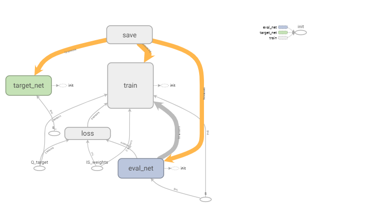

#### Q-Network

Here is my basic Q-network structure. In this model, I have two hidden layers using relu activation funtion. The first layer has 400 units and the second layer also has 400 units. 

Since we get our input state from gym outcome, there are 8 input  units for the network, and 4 output units for the output, standing for the value of each action.

 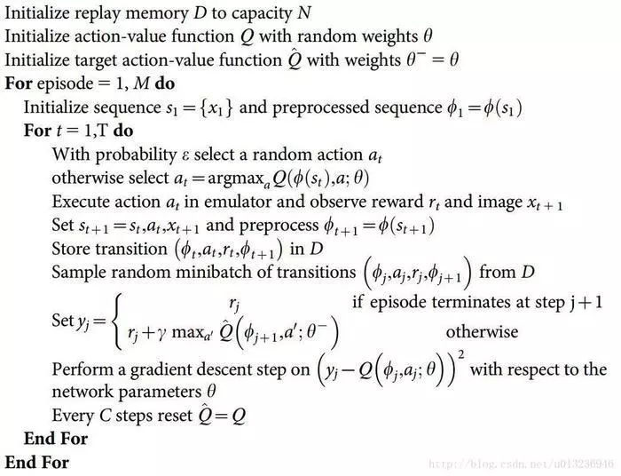 

After the relu hidden layers, there is a dueling deep Q Network structure. More details of the structure of dueling deep Q network are in the following section.  

```python
def build_layers(s, c_names, w_initializer, b_initializer):
    regularizer = tf.contrib.layers.l1_regularizer(0.05);
    for i, h in enumerate(self.hidden):
        if i == 0:
            in_units, out_units, inputs = self.n_features, self.hidden[i], s
            else:
                in_units, out_units, inputs = self.hidden[i-1], self.hidden[i], l
                with tf.variable_scope('l%i' % i):
                    w = tf.get_variable('w', [in_units, out_units], initializer=w_initializer, collections=c_names,)
                    b = tf.get_variable('b', [1, out_units], initializer=b_initializer, collections=c_names)
                    l = tf.nn.relu(tf.matmul(inputs, w) + b)

                    with tf.variable_scope('Value'):
                        w = tf.get_variable('w', [self.hidden[-1], 1], initializer=w_initializer, collections=c_names)
                        b = tf.get_variable('b', [1, 1], initializer=b_initializer, collections=c_names)
                        self.V = tf.matmul(l, w) + b

                        with tf.variable_scope('Advantage'):
                            w = tf.get_variable('w', [self.hidden[-1], self.n_actions], initializer=w_initializer, collections=c_names)
                            b = tf.get_variable('b', [1, self.n_actions], initializer=b_initializer, collections=c_names)
                            self.A = tf.matmul(l, w) + b

                            with tf.variable_scope('Q'):
                                out = self.V + (self.A - tf.reduce_mean(self.A, axis=1, keep_dims=True))  # Q = V(s) + A(s,a)

                                return out
```

After building the network layers, we need to build two network, one is the evaluate net , another is the target net

```python
        # ------------------ build evaluate_net ------------------
        self.s = tf.placeholder(tf.float32, [None, self.n_features], name='s')  # input
        self.q_target = tf.placeholder(tf.float32, [None, self.n_actions], name='Q_target')  # for calculating loss
        self.ISWeights = tf.placeholder(tf.float32, [None, 1], name='IS_weights')
        with tf.variable_scope('eval_net'):
            c_names, w_initializer, b_initializer = \
                ['eval_net_params', tf.GraphKeys.GLOBAL_VARIABLES], \
                tf.random_normal_initializer(0., 0.01), tf.constant_initializer(0.01)  # config of layers

            self.q_eval = build_layers(self.s, c_names, w_initializer, b_initializer)

        with tf.variable_scope('loss'):
            self.abs_errors = tf.abs(tf.reduce_sum(self.q_target - self.q_eval, axis=1))  # for updating Sumtree
            self.loss = tf.reduce_mean(self.ISWeights * tf.squared_difference(self.q_target, self.q_eval))

        with tf.variable_scope('train'):
            self._train_op = tf.train.AdamOptimizer(self.lr).minimize(self.loss)

        # ------------------ build target_net ------------------
        self.s_ = tf.placeholder(tf.float32, [None, self.n_features], name='s_')  # input
        with tf.variable_scope('target_net'):
            c_names = ['target_net_params', tf.GraphKeys.GLOBAL_VARIABLES]
            self.q_next = build_layers(self.s_, c_names, w_initializer, b_initializer)

```

#### Dueling Deep Q Network

Here is the basic structure of dueling deep Q network[2]

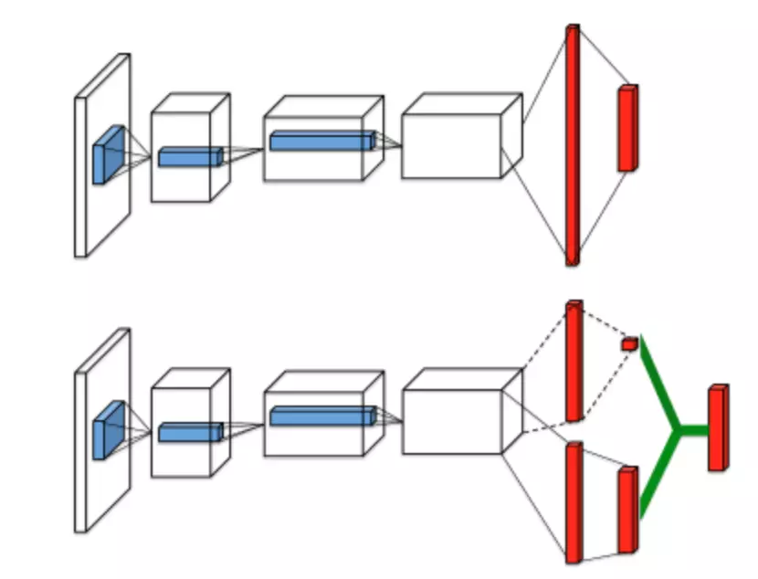 


Our dueling network represents two separate estimators: one for the state value function and one for the state-dependent action advantage function. The main benefit of this factoring is to generalize learning across actions without imposing any change to the underlying reinforcement learning algorithm. Our results show that this architecture leads to better policy evaluation in the presence of many similar-valued actions 

```python
with tf.variable_scope('Value'):
    w = tf.get_variable('w', [self.hidden[-1], 1], initializer=w_initializer, collections=c_names)
    b = tf.get_variable('b', [1, 1], initializer=b_initializer, collections=c_names)
    self.V = tf.matmul(l, w) + b

with tf.variable_scope('Advantage'):
    w = tf.get_variable('w', [self.hidden[-1], self.n_actions], initializer=w_initializer, collections=c_names)
    b = tf.get_variable('b', [1, self.n_actions], initializer=b_initializer, collections=c_names)
    self.A = tf.matmul(l, w) + b

with tf.variable_scope('Q'):
    out = self.V + (self.A - tf.reduce_mean(self.A, axis=1, keep_dims=True))  # Q = V(s) + A(s,a)
```

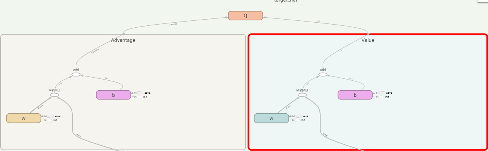

#### Double Q-Network

 According to the Paper Deep Reinforcement Learning with Double Q-learning[1], the original DQN algorithm which combines Q-learning with a deep neural work, suffers from substantial  overestimations in some games, and using double DQN, it can reduce the observed overestimations, as hypothesized, but that this also leads to much better performance  

The main idea of Double Q-Network is the following formula 

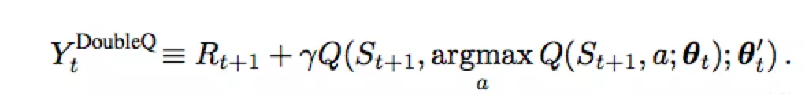 

This mainly reflects in the learning part

```python
    def learn(self):
#        if self.learn_step_counter % self.replace_target_iter == 0:
#            self._replace_target_params();
##            self.epsilon = self.epsilon + self.epsilon_increment if self.epsilon < self.epsilon_max else self.epsilon_max
#            self.epsilon = 1 - (1 - self.epsilon) * 0.98 if self.epsilon < self.epsilon_max else self.epsilon_max
#            self._saveWeight();
        if self.learn_step_counter % self.replace_target_iter == 0:
            self._update();
        tree_idx, batch_memory, ISWeights = self.memory.sample(self.batch_size)


        # double DQN
        q_next, q_eval4next = self.sess.run(
            [self.q_next, self.q_eval],
            feed_dict={self.s_: batch_memory[:, -self.n_features-1:-1],  # next observation
                       self.s: batch_memory[:, -self.n_features-1:-1]})  # next observation
        q_eval = self.sess.run(self.q_eval, {self.s: batch_memory[:, :self.n_features]})

        q_target = q_eval.copy()

        batch_index = np.arange(self.batch_size, dtype=np.int32)
        eval_act_index = batch_memory[:, self.n_features].astype(int)
        reward = batch_memory[:, self.n_features + 1]
        max_act4next = np.argmax(q_eval4next,
                                 axis=1)  # the action that brings the highest value is evaluated by q_eval
        selected_q_next = q_next[batch_index, max_act4next]  # Double DQN, select q_next depending on above actions


        for i in range(self.batch_size):
            terminal = batch_memory[batch_index[i]][-1];
            if terminal:
                q_target[batch_index[i], eval_act_index[i]] = reward[i];
            else:
                q_target[batch_index[i], eval_act_index[i]] = reward[i] + self.gamma * selected_q_next[i]

#        q_target[batch_index, eval_act_index] = reward + self.gamma * selected_q_next


        #优化一次        
        _, abs_errors, self.cost = self.sess.run([self._train_op, self.abs_errors, self.loss],
                                                 feed_dict={self.s: batch_memory[:, :self.n_features],
                                                            self.q_target: q_target,
                                                            self.ISWeights: ISWeights})
        for i in range(len(tree_idx)):  # update priority
            idx = tree_idx[i]
            self.memory.update(idx, abs_errors[i])

        self.cost_his.append(self.cost)

#        self.epsilon = self.epsilon + self.epsilon_increment if self.epsilon < self.epsilon_max else self.epsilon_max
        self.learn_step_counter += 1
```

#### Prioritized Replay

Prioritized Experience Replay (PER) was introduced in 2015 by [Tom Schaul](https://arxiv.org/search?searchtype=author&query=Schaul%2C+T)[3]. The idea is that some experiences may be more important than others for our training, but might occur less frequently.

Because we sample the batch uniformly (selecting the experiences randomly) these rich experiences that occur rarely have practically no chance to be selected.

That’s why, with PER, we try to change the sampling distribution by using a criterion to define the priority of each tuple of experience.

We want to take in priority experience where there is a big difference between our prediction and the TD target, since it means that we have a lot to learn about it.

We use the absolute value of the magnitude of our TD error:

  

And we **put that priority in the experience of each replay buffer.**


But we can’t just do greedy prioritization, because it will lead to always training the same experiences (that have big priority), and thus over-fitting.

So we introduce stochastic prioritization, **which generates the probability of being chosen for a replay.**


As consequence, during each time step, we will get a batch of samples with this probability distribution and train our network on it.

But, we still have a problem here. Remember that with normal Experience Replay, we use a stochastic update rule. As a consequence, the **way we sample the experiences must match the underlying distribution they came from.**

When we do have normal experience, we select our experiences in a normal distribution — simply put, we select our experiences randomly. There is no bias, because each experience has the same chance to be taken, so we can update our weights normally.

**But**, because we use priority sampling, purely random sampling is abandoned. As a consequence, we introduce bias toward high-priority samples (more chances to be selected).

And, if we update our weights normally, we take have a risk of over-fitting. Samples that have high priority are likely to be used for training many times in comparison with low priority experiences (= bias). As a consequence, we’ll update our weights with only a small portion of experiences that we consider to be really interesting.

To correct this bias, we use importance sampling weights (IS) that will adjust the updating by reducing the weights of the often seen samples.


The weights corresponding to high-priority samples have very little adjustment (because the network will see these experiences many times), whereas those corresponding to low-priority samples will have a full update.

The role of **b** is to control how much these importance sampling weights affect learning. In practice, the b parameter is annealed up to 1 over the duration of training, because these weights are more important in the end of learning when our q values begin to converge.

Here we use SumTree for implementation

A sumtree is a Binary Tree, that is a tree with only a maximum of two children for each node. The leaves (deepest nodes) contain the priority values, and a data array that points to leaves contains the experiences.

Updating the tree and sampling will be really efficient (O(log n)).

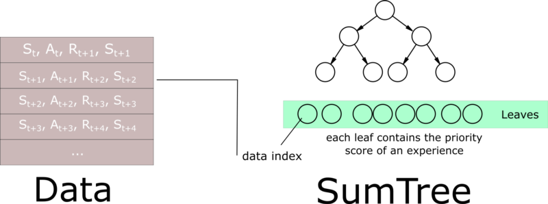

```python
class SumTree(object):
    """
    This SumTree code is modified version and the original code is from:
    https://github.com/jaara/AI-blog/blob/master/SumTree.py

    Story the data with it priority in tree and data frameworks.
    """
    data_pointer = 0

    def __init__(self, capacity):
        self.capacity = capacity  # for all priority values
        self.tree = np.zeros(2 * capacity - 1)
        # [--------------Parent nodes-------------][-------leaves to recode priority-------]
        #             size: capacity - 1                       size: capacity
        self.data = np.zeros(capacity, dtype=object)  # for all transitions
        # [--------------data frame-------------]
        #             size: capacity

    def add_new_priority(self, p, data):
        leaf_idx = self.data_pointer + self.capacity - 1

        self.data[self.data_pointer] = data  # update data_frame
        self.update(leaf_idx, p)  # update tree_frame
        self.data_pointer += 1
        if self.data_pointer >= self.capacity:  # replace when exceed the capacity
            self.data_pointer = 0

    def update(self, tree_idx, p):
        change = p - self.tree[tree_idx]

        self.tree[tree_idx] = p
        self._propagate_change(tree_idx, change)

    def _propagate_change(self, tree_idx, change):
        """change the sum of priority value in all parent nodes"""
        parent_idx = (tree_idx - 1) // 2
        self.tree[parent_idx] += change
        if parent_idx != 0:
            self._propagate_change(parent_idx, change)

    def get_leaf(self, lower_bound):
        leaf_idx = self._retrieve(lower_bound)  # search the max leaf priority based on the lower_bound
        data_idx = leaf_idx - self.capacity + 1
        return [leaf_idx, self.tree[leaf_idx], self.data[data_idx]]

    def _retrieve(self, lower_bound, parent_idx=0):
        """
        Tree structure and array storage:

        Tree index:
             0         -> storing priority sum
            / \
          1     2
         / \   / \
        3   4 5   6    -> storing priority for transitions

        Array type for storing:
        [0,1,2,3,4,5,6]
        """
        left_child_idx = 2 * parent_idx + 1
        right_child_idx = left_child_idx + 1

        if left_child_idx >= len(self.tree):  # end search when no more child
            return parent_idx

        if self.tree[left_child_idx] == self.tree[right_child_idx]:
            return self._retrieve(lower_bound, np.random.choice([left_child_idx, right_child_idx]))
        if lower_bound <= self.tree[left_child_idx]:  # downward search, always search for a higher priority node
            return self._retrieve(lower_bound, left_child_idx)
        else:
            return self._retrieve(lower_bound - self.tree[left_child_idx], right_child_idx)

    @property
    def root_priority(self):
        return self.tree[0]  # the root
```

Based on the sumTree, we can construct the replay memory buffer

```python
class Memory(object):  # stored as ( s, a, r, s_ ) in SumTree
    """
    This SumTree code is modified version and the original code is from:
    https://github.com/jaara/AI-blog/blob/master/Seaquest-DDQN-PER.py
    """
    epsilon = 0.001  # small amount to avoid zero priority
    alpha = 0.6  # [0~1] convert the importance of TD error to priority
    beta = 0.4  # importance-sampling, from initial value increasing to 1
    beta_increment_per_sampling = 1e-4  # annealing the bias
    abs_err_upper = 1   # for stability refer to paper

    def __init__(self, capacity):
        self.tree = SumTree(capacity)

    def store(self, error, transition):
        p = self._get_priority(error)
        self.tree.add_new_priority(p, transition)

    def sample(self, n):
        batch_idx, batch_memory, ISWeights = [], [], []
        segment = self.tree.root_priority / n
        self.beta = np.min([1, self.beta + self.beta_increment_per_sampling])  # max = 1

        min_prob = np.min(self.tree.tree[-self.tree.capacity:]) / self.tree.root_priority
        maxiwi = np.power(self.tree.capacity * min_prob, -self.beta)  # for later normalizing ISWeights
        for i in range(n):
            a = segment * i
            b = segment * (i + 1)
            lower_bound = np.random.uniform(a, b)
            idx, p, data = self.tree.get_leaf(lower_bound)
            prob = p / self.tree.root_priority
            ISWeights.append(self.tree.capacity * prob)
            batch_idx.append(idx)
            batch_memory.append(data)

        ISWeights = np.vstack(ISWeights)
        ISWeights = np.power(ISWeights, -self.beta) / maxiwi  # normalize
        return batch_idx, np.vstack(batch_memory), ISWeights

    def update(self, idx, error):
        p = self._get_priority(error)
        self.tree.update(idx, p)

    def _get_priority(self, error):
        error += self.epsilon   # avoid 0
        clipped_error = np.clip(error, 0, self.abs_err_upper)
        return np.power(clipped_error, self.alpha)
```

### Evaluation Process

#### Framework

each time we store the current state action reward and the previous state into replay buffer, and learn to optimize the model.

```python
total_steps = 0
running_r = 0
r_scale = 100
average_reward = deque(maxlen = 20);

for i_episode in range(MAX_EPISODES):
    s = env.reset()  # (coord_x, coord_y, vel_x, vel_y, angle, angular_vel, l_leg_on_ground, r_leg_on_ground)
    current_reward = 0
    
    for t in range(1000):
        signal.signal(signal.SIGINT, CtrlCHandler)
#        env.render();
        a = agent.choose_action(s);
        s_, r, is_terminal, info = env.step(a)
        current_reward += r;
        agent.store_transition(s, a, r, s_, is_terminal);
        if (total_steps > MEMORY_CAPACITY):
            agent.learn()
        if is_terminal or current_reward < MINIMUM_REWARD:
            break;
        s = s_;
        total_steps += 1;
        
#        if total_steps % TARGET_REP_ITER == 0:
#            agent.update();
#    agent.update();
    
    average_reward.append(current_reward);
    print("%i, %.2f, %.2f, %.2f" % (i_episode, current_reward, np.average(average_reward), agent.epsilon))

```

#### Choose Action

To choose the action, we use the  *epsilon greedy*  method

 A common approach to balancing the exploitation-exploration tradeoff is the *epilson-* or *e-greedy* algorithm*.* Greedy here means what you probably think it does. After an initial period of exploration (for example 1000 trials), the algorithm greedily exploits the best option *k*, *e* percent of the time. For example, if we set *e*=0.05, the algorithm will exploit the best variant 95% of the time and will explore random alternatives 5% of the time. This is actually quite effective in practice, but as we’ll come to see it can under explore the variant space before exploiting what it estimates to be the strongest variant. This means that e-greedy can get stuck exploiting a suboptimal variant. Let’s dive into some code to show e-greedy in a action. 

```python
    def choose_action(self, observation):
        observation = observation[np.newaxis, :]
        if np.random.uniform() > self.epsilon or self.training:
            actions_value = self.sess.run(self.q_eval, feed_dict={self.s: observation})
            action = np.argmax(actions_value)
        else:
            action = np.random.randint(0, self.n_actions)
        return action
```

#### Store in Replay Buffer

As mentioned above, prioritized buffer is used in this project

```python
    def store_transition(self, s, a, r, s_, is_terminal ):
        transition = np.hstack((s, [a, r], s_, is_terminal))
        max_p = np.max(self.memory.tree.tree[-self.memory.tree.capacity:])
        self.memory.store(max_p, transition)
```

#### Learn

```python
    def learn(self):
#        if self.learn_step_counter % self.replace_target_iter == 0:
#            self._replace_target_params();
##            self.epsilon = self.epsilon + self.epsilon_increment if self.epsilon < self.epsilon_max else self.epsilon_max
#            self.epsilon = 1 - (1 - self.epsilon) * 0.98 if self.epsilon < self.epsilon_max else self.epsilon_max
#            self._saveWeight();
        if self.learn_step_counter % self.replace_target_iter == 0:
            self._update();
        tree_idx, batch_memory, ISWeights = self.memory.sample(self.batch_size)


        # double DQN
        q_next, q_eval4next = self.sess.run(
            [self.q_next, self.q_eval],
            feed_dict={self.s_: batch_memory[:, -self.n_features-1:-1],  # next observation
                       self.s: batch_memory[:, -self.n_features-1:-1]})  # next observation
        q_eval = self.sess.run(self.q_eval, {self.s: batch_memory[:, :self.n_features]})

        q_target = q_eval.copy()

        batch_index = np.arange(self.batch_size, dtype=np.int32)
        eval_act_index = batch_memory[:, self.n_features].astype(int)
        reward = batch_memory[:, self.n_features + 1]
        max_act4next = np.argmax(q_eval4next,
                                 axis=1)  # the action that brings the highest value is evaluated by q_eval
        selected_q_next = q_next[batch_index, max_act4next]  # Double DQN, select q_next depending on above actions


        for i in range(self.batch_size):
            terminal = batch_memory[batch_index[i]][-1];
            if terminal:
                q_target[batch_index[i], eval_act_index[i]] = reward[i];
            else:
                q_target[batch_index[i], eval_act_index[i]] = reward[i] + self.gamma * selected_q_next[i]

#        q_target[batch_index, eval_act_index] = reward + self.gamma * selected_q_next


        #优化一次        
        _, abs_errors, self.cost = self.sess.run([self._train_op, self.abs_errors, self.loss],
                                                 feed_dict={self.s: batch_memory[:, :self.n_features],
                                                            self.q_target: q_target,
                                                            self.ISWeights: ISWeights})
        for i in range(len(tree_idx)):  # update priority
            idx = tree_idx[i]
            self.memory.update(idx, abs_errors[i])

        self.cost_his.append(self.cost)

#        self.epsilon = self.epsilon + self.epsilon_increment if self.epsilon < self.epsilon_max else self.epsilon_max
        self.learn_step_counter += 1
```

we need to do update during the learning process. We decay the epsilon and replace the parameters of the target net and evaluate net

```python
    def _update(self):
        self._replace_target_params();
        if self.epsilon > 0.01:
            self.epsilon *= self.epsilon_decay;
        self._saveWeight();    
```

### Result

The following is the result that I train for less than 1000 Episodes. 

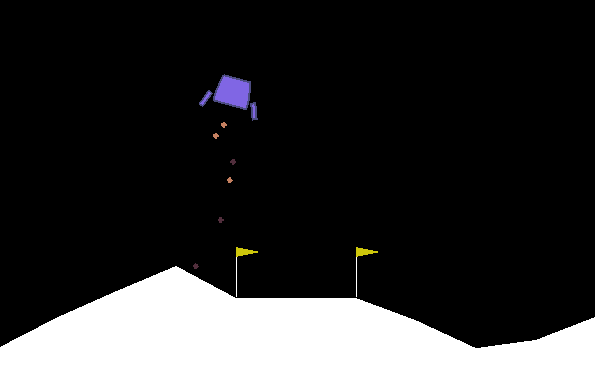

Generally speaking, the model is stable and good. Here is the leader board for LunarLander-v2, it seems as if my model performs well.

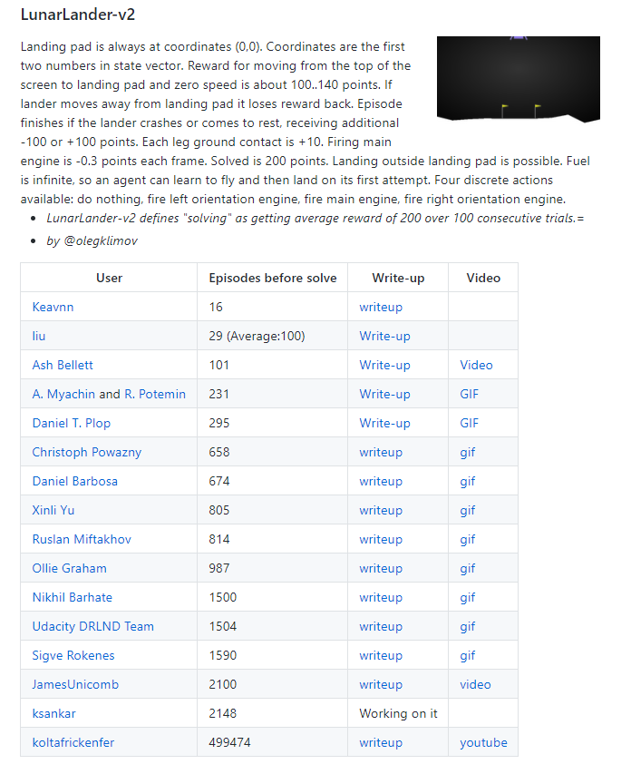

### Personal Thoughts

Though this version is "simple", but it does take me a lot of time to finish it. 

- At first, I used regularization, but soon found that the regularization effect was not good. After careful consideration, I think it may be because reinforcement learning is very sensitive to state, that is to say, a little change in state may result in the great change of the output value, especially at the critical point of the state. Though I remove regularization term in the network.
- I firstly set epsilon value very small, which constraint the agent's ability to exploit the environment, making it hard to find the best solution to land, i.e., it always learns a strange method to land. Though it can get some positive score (around 150), it is actually not good enough. So I then set the epsilon big enough so that the agent initially search the environment nearly random, and decrease epsilon gradually, so that it can converge to the optimization.

## Raw Pixels  Input Version

This part is much harder than the previous part, and it did take me lots of time to train by using personal PC.

### Preprocess

The original image of the gym is RGB with 400 x 600 pixels, which is too large (at least for my personal computer) to compute. So some under sample and some preprocess are needed. 

I firstly use openCV to shrink the size of the input image into 100 x 150, and change the RGB mode into the gray

```python
def imagePreprocess(pixels):
    s_pixels = cv2.cvtColor(cv2.resize(pixels, (IMAGE_WIDTH, IMAGE_HEIGHT)), cv2.COLOR_BGR2GRAY)
    ret, s_pixels = cv2.threshold(s_pixels, 1, 255, cv2.THRESH_BINARY);
    s_pixels = np.reshape(s_pixels, (IMAGE_HEIGHT, IMAGE_WIDTH, 1));
#    s_pixels = s_pixels.flatten();
    return s_pixels
```

So we replace the pixels as the input state instead of getting from gym

### Model

#### CNN

the DQN parts remains the same, but here I added some CNN layers for image processing. 

Here I use 3 convolution layer. The first hidden convolves 32 8x8 filters with stride 4 and applies a rectifier nonlinearity. The second hidden convolves 64 5x5 filters with stride 2 and applies a rectifier nonlinearity. The last hidden convolves 64 3x3 filters with stride 1 and also applies a rectifier nonlinearity. Then is the fully-connected layers as the previous section. Noticed that we apply regularizer here because the network is much more complicated.

```python
    def weight_variable(self,shape):
        initial = tf.truncated_normal(shape, stddev = 0.01)
        return tf.Variable(initial)

    def bias_variable(self,shape):
        initial = tf.constant(0.01, shape = shape)
        return tf.Variable(initial)

    def conv2d(self,x, W, stride):
        return tf.nn.conv2d(x, W, strides = [1, stride, stride, 1], padding = "VALID")

    def max_pool_2x2(self,x):
        return tf.nn.max_pool(x, ksize = [1, 2, 2, 1], strides = [1, 2, 2, 1], padding = "SAME")

    def _build_net(self):
        def build_layers(s, c_names, w_initializer, b_initializer):
            regularizer = tf.contrib.layers.l1_regularizer(0.05);
            
            s = tf.reshape(s, [-1, self.image_height, self.image_width, FRAME_NUMBER])
            
            W_conv1 = self.weight_variable([9, 9, 4, 32]);
            b_conv1 = self.bias_variable([32]);
            
            h_conv1 = tf.nn.relu(self.conv2d(s, W_conv1, 4) + b_conv1);
            
            h_pool1 = self.max_pool_2x2(h_conv1);
            
            W_conv2 = self.weight_variable([5, 5, 32, 64]);
            b_conv2 = self.bias_variable([64]);
            
            h_conv2 = tf.nn.relu(self.conv2d(h_pool1, W_conv2, 2) + b_conv2);
            
            W_conv3 = self.weight_variable([3, 3, 64, 64]);
            b_conv3 = self.bias_variable([64]);
            h_conv3 = tf.nn.relu(self.conv2d(h_conv2, W_conv3, 1) + b_conv3);
            
            h_conv3_shape = h_conv3.get_shape().as_list();
            print(h_conv3_shape);#[None, 6, 11, 64]
            flatten_size = h_conv3_shape[1] * h_conv3_shape[2] * h_conv3_shape[3];
            
            h_conv3_flat = tf.reshape(h_conv3, [-1, flatten_size]);
            
            ...
```

### Evaluation Process

#### Framework

The framework of the model nearly the same as before, but we replace the state from what gets from gym to raw pixels, other steps are similar to the previous section, thus I am not going to cover the detail of that.

```python
for i_episode in range(MAX_EPISODES):
    s = env.reset()  # (coord_x, coord_y, vel_x, vel_y, angle, angular_vel, l_leg_on_ground, r_leg_on_ground)
    current_reward = 0
    
    pixels = env.render(mode="rgb_array");
    s_pixels = imagePreprocess(pixels);

    for t in range(1000):
        signal.signal(signal.SIGINT, CtrlCHandler)
#        print("%i, %.2f, %.2f, %.2f" % (i_episode, current_reward, np.average(average_reward), agent.epsilon))
#        env.render();
        a = agent.choose_action(s_pixels);
        s_, r, is_terminal, info = env.step(a)
        
        s_next_pixels = env.render(mode="rgb_array");
        s_next_pixels = imagePreprocess(s_next_pixels);
        
        current_reward += r;

        if (total_steps < MEMORY_CAPACITY):
            agent.store_transition(s_pixels, a, r, s_next_pixels, is_terminal);
        
        if (total_steps > MEMORY_CAPACITY):
                agent.learn()
        if is_terminal or current_reward < MINIMUM_REWARD:
            break;
        s = s_;
        total_steps += 1;
        
#        print("%i, %.2f, %.2f, %.2f" % (i_episode, current_reward, np.average(average_reward), agent.epsilon))
        
#        if total_steps % TARGET_REP_ITER == 0:
#            agent.update();
#    agent.update();
    
    average_reward.append(current_reward);
    print("%i, %.2f, %.2f, %.2f" % (i_episode, current_reward, np.average(average_reward), agent.epsilon))
```

### Model1--Result

I firstly apply the method mentioned above, and try to train the network, but finally I got the result below. As we can see that it learn a policy that "No-Landing", the agent is afraid of crash, so it decides not to land at all. 

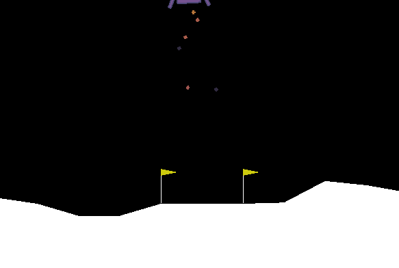

**Why** ?

I check the cost of the network during the training process, and find that it does decrease gradually. So where is the problem? I take a reference of Atari Game[4], and get the answer. I just input the current image as the current state and try to get the output action value. But we can not get the whole information just from the current image, for example, the speed and direction can not get from the single image. So when the agent get the image, it can decide whether the plane is down or up. So to avoid crash (which will pay a lot), it decide to go straight up (the score will at least higher than directly crash)

### Model2--Result

Since I know the reason of why the agent does not land at not. I develop another new model and try to get a better score.

To run the model faster, I modify the preprocess function of the input image (in fact make the image output as small as possible). I shrink the size of the image into 100x85

```python

def imagePreprocess(pixels):
#    pixels = cv2.medianBlur(pixels, 9)
    s_pixels_ = cv2.cvtColor(cv2.resize(pixels, (150, 100)), cv2.COLOR_BGR2GRAY)[:85, 25:125]
    ret, s_pixels_ = cv2.threshold(s_pixels_, 1, 255, cv2.THRESH_BINARY);
    s_pixels_ = np.reshape(s_pixels_, (IMAGE_HEIGHT, IMAGE_WIDTH, 1));
    s_pixels_ = s_pixels_.flatten();
    return s_pixels_
```

Beside, the input state contain 4 frames (one is the current frame, three are the previous frame). 

```python
    def setInitState(self, observation):
        observation = observation[np.newaxis, :]
        self.currentState = np.stack((observation, observation, observation, observation), axis = 2);
        self.currentAction = np.zeros((ACTION_NUMBER,))
```

Correspondingly, the store of the replay memory should be modified as well

```python
    def store_transition(self, s, a, r, s_, is_terminal ):
        s_ = s_.reshape(1, self.image_height * self.image_width, 1)
        newState = np.append(s_, self.currentState[:,:,1:], axis=2)
        action = self.currentAction.tolist();
        action.insert(0, a)
        action.pop();
        self.currentAction = np.array(action)
        transition = np.hstack((self.currentState.flatten(), self.currentAction, [r], newState.flatten(), is_terminal));
        self.currentState = newState;
#        transition = np.hstack((s, [a, r], s_, is_terminal))
        max_p = np.max(self.memory.tree.tree[-self.memory.tree.capacity:])
        self.memory.store(max_p, transition)
```

Others small modification are also need, but I will not cover the detail (please see the code ^_^)

Unfortunately, the agent learns a negative policy, that is do nothing ... In fact, this policy does win much more credit than random operation. It is at least much better than random search and "No-Landing" policy.

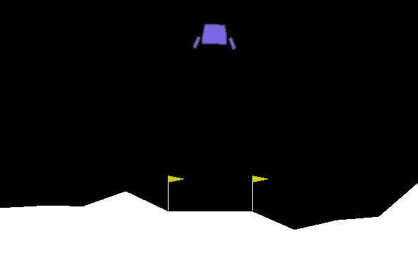

### Model3--Result

Since that training directly from raw pixels is so difficult, I wonder that whether I can train with both raw pixels and status. Which means that I train a neural network with the raw pixels as input and try to output status, then use the pre-training DQN to output the Q-value of the status. Based on this idea, I design the following neural network

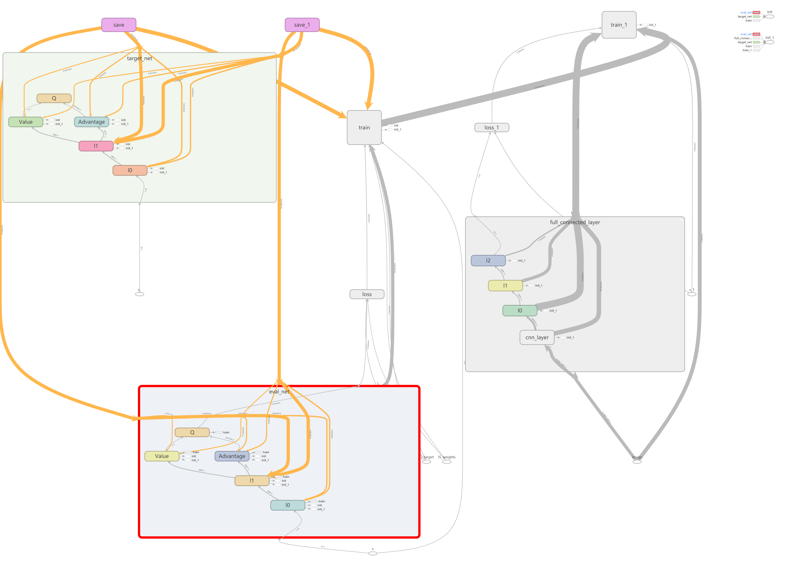

The network on the left side is the dueling DQN mentioned above, and the right sides are the convolution neural network and try to get the current states according to raw pixels as input. Here are the structure of the convolution neural network.

```python
def build_net(self):

    def build_layers(s, c_name, w_initializer, b_initializer):
        regularizer = tf.contrib.layers.l1_regularizer(0.05);

        #            W_conv1 = self.weight_variable([8, 8, FRAME_NUMBER, 32]);
        #            b_conv1 = self.bias_variable([32]);
        with tf.variable_scope("cnn_layer"):
            W_conv1 = tf.get_variable("W_conv1", [8, 8, FRAME_NUMBER, 32], initializer=w_initializer);
            b_conv1 = tf.get_variable("b_conv1", [32], initializer=w_initializer)
            self.b_conv1 = b_conv1;

            h_conv1 = tf.nn.relu(self.conv2d(s, W_conv1, 4) + b_conv1);
            h_conv1 = h_conv1;

            #            W_conv2 = self.weight_variable([4, 4, 32, 64]);
            #            b_conv2 = self.bias_variable([64]);
            W_conv2 = tf.get_variable("W_conv2", [4, 4, 32, 64], initializer=w_initializer);
            b_conv2 = tf.get_variable("b_conv2", [64], initializer=w_initializer)

            h_conv2 = tf.nn.relu(self.conv2d(h_conv1, W_conv2, 2) + b_conv2);

            #            W_conv3 = self.weight_variable([3, 3, 64, 64]);
            #            b_conv3 = self.bias_variable([64]);
            W_conv3 = tf.get_variable("W_conv3", [3, 3, 64, 64], initializer=w_initializer);
            b_conv3 = tf.get_variable("b_conv3", [64], initializer=w_initializer)

            h_conv3 = tf.nn.relu(self.conv2d(h_conv2, W_conv3, 1) + b_conv3);

            h_conv3_shape = h_conv3.get_shape().as_list();
            print(h_conv3_shape);#[None, 6, 11, 64]
            flatten_size = h_conv3_shape[1] * h_conv3_shape[2] * h_conv3_shape[3];

            h_conv3_flat = tf.reshape(h_conv3, [-1, flatten_size]);
            self.h3 = h_conv3_flat;   
            #            
            #            flatten_size = 200 * 300 * 5;
            #            h_conv3_flat = tf.reshape(s, [-1, flatten_size])

            #full connect layers
            self.hidden = [400, 400, self.output_size]


            for i, h in enumerate(self.hidden):
                if i == 0:
                    in_units, out_units, inputs = flatten_size, self.hidden[i], h_conv3_flat
                    else:
                        in_units, out_units, inputs = self.hidden[i-1], self.hidden[i], l
                        with tf.variable_scope('l%i' % i):
                            w = tf.get_variable('w', [in_units, out_units], initializer=w_initializer, collections=c_names, regularizer=regularizer)
                            b = tf.get_variable('b', [1, out_units], initializer=b_initializer, collections=c_names, regularizer=regularizer)
                            l = tf.nn.leaky_relu(tf.matmul(inputs, w) + b)
                            self.w = w;
                            self.b = b;


                            with tf.variable_scope("cnn_out"):
                                out = l
                                return out

                            self.image_input = tf.placeholder(tf.float32, [None, self.image_height, self.image_width, FRAME_NUMBER], name="image")
                            self.state = tf.placeholder(tf.float32, [None, self.output_size], name='s')

                            with tf.variable_scope('full_connected_layer'):
                                c_names, w_initializer, b_initializer = \
                                ['eval_net_params', tf.GraphKeys.GLOBAL_VARIABLES], \
                                tf.random_normal_initializer(0., 0.1), tf.constant_initializer(0.1)  # config of layers
                                self.cnn_net = build_layers(self.image_input, c_names, w_initializer, b_initializer)

                                with tf.variable_scope("loss"):
                                    self.loss = tf.reduce_mean(tf.squared_difference(self.cnn_net, self.state))

                                    with tf.variable_scope("train"):
                                        self._train_op = tf.train.AdamOptimizer(self.lr).minimize(self.loss)
```

Here is the diagram of the convolution neural network.

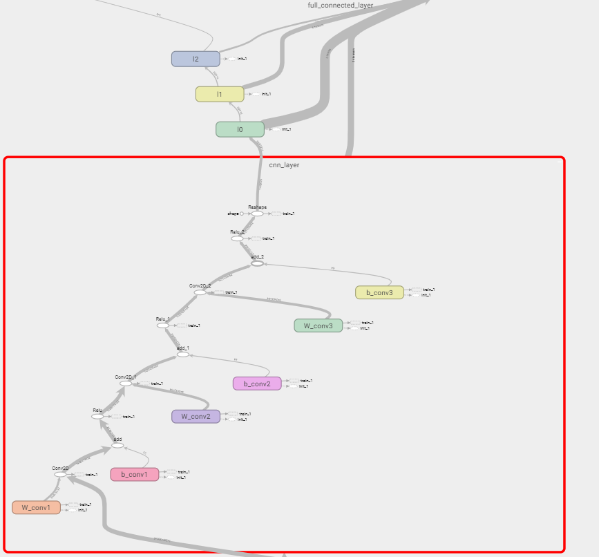

The framework of the training the convolution neural network

```python
for i_episode in range(MAX_EPISODES):
    s = env.reset()  # (coord_x, coord_y, vel_x, vel_y, angle, angular_vel, l_leg_on_ground, r_leg_on_ground)
    current_reward = 0
    
    pixels = env.render(mode="rgb_array");
#    pixels = imagePreprocess(pixels);
#    cnn_model.learn(pixels, s)
    
    for t in range(3):
        a = 0;
        s, r, is_terminal, info = env.step(a)
    
    #初始化操作
    s_next_pixels = env.render(mode="rgb_array")
    s_next_pixels = imagePreprocess(s_next_pixels)
    cnn_model.setInitState(s_next_pixels);
    
    for t in range(200):
        signal.signal(signal.SIGINT, CtrlCHandler)

        a = agent.choose_action(s);
        s_, r, is_terminal, info = env.step(a)
        
        s_next_pixels = env.render(mode="rgb_array");
        s_next_pixels = imagePreprocess(s_next_pixels);
        cnn_model.storeState(s_next_pixels)
        cnn_model.learn(s_)
        
        current_reward += r;
        agent.store_transition(s, a, r, s_, is_terminal);
        if (total_steps > MEMORY_CAPACITY):
            agent.learn()
        if is_terminal or current_reward < MINIMUM_REWARD:
            break;
        s = s_;
        total_steps += 1;
        
```

After training for a whole night, the convolution neural network converges to the status where the loss is approximately 0.01. Though it seems exciting to get such low loss, it is  actually not accurate enough, because value fields of the 8 states in mostly fall into the range[0, 1], thus, the loss is still to high. The results are shown below, it is just slightly better than random policy. /(ㄒoㄒ)/~~Although I tried to train two networks in turn, the effect was still poor

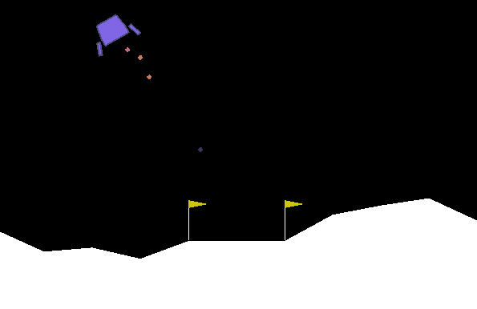

### Model4--Result

We separated the two networks and trained them separately. Now we try to combine the two networks together. The following graph show the main structure of the neural network. It does look like the DQN framework.

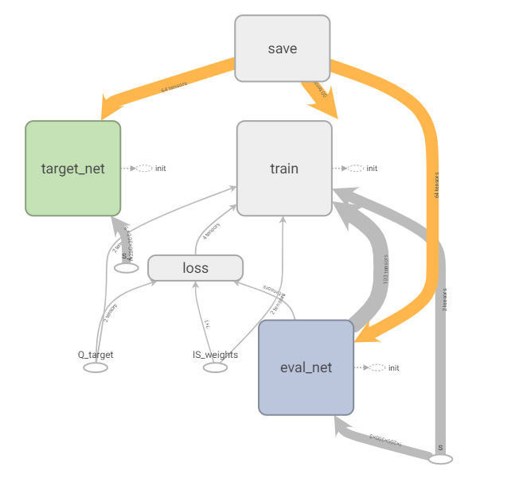

What is different from the previous model is that it is embed with cnn layers. 

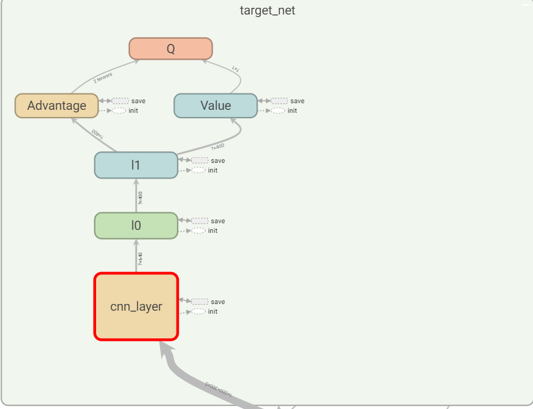

I firstly adopt the cnn structure in model3, after training for whole day, I was upset to find that the neural network gradient had exploded, all the output is 'nan' no matter what is it the input. To deal with this problem, I add batch normalization layer after the convolution layer.

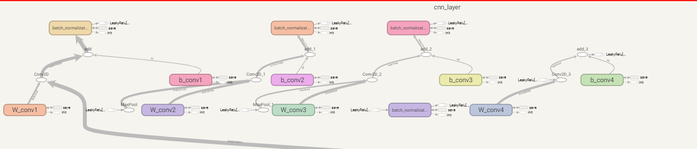

```python
def _build_net(self):
    def build_layers(s, c_names, w_initializer, b_initializer):
        regularizer = tf.contrib.layers.l1_regularizer(0.05);

        with tf.variable_scope("cnn_layer"):
            W_conv1 = tf.get_variable("W_conv1", [8, 8, FRAME_NUMBER, 32], initializer=w_initializer);
            b_conv1 = tf.get_variable("b_conv1", [32], initializer=w_initializer)
            self.b_conv1 = b_conv1;

            print(s.shape)
            print(W_conv1.shape)
            h_conv1_ = (self.conv2d(s, W_conv1, 4) + b_conv1);
            h_conv1 = tf.nn.leaky_relu(tf.layers.batch_normalization(h_conv1_, training=self.training))
            self.h_conv1 = h_conv1;

            h_pool1 = self.max_pool_2x2(h_conv1);

            #            W_conv2 = self.weight_variable([4, 4, 32, 64]);
            #            b_conv2 = self.bias_variable([64]);
            W_conv2 = tf.get_variable("W_conv2", [4, 4, 32, 64], initializer=w_initializer);
            b_conv2 = tf.get_variable("b_conv2", [64], initializer=w_initializer)

            h_conv2_ = (self.conv2d(h_pool1, W_conv2, 2) + b_conv2);
            h_conv2 = tf.nn.leaky_relu(tf.layers.batch_normalization(h_conv2_, training=self.training))

            h_pool2 = self.max_pool_2x2(h_conv2)

            #            W_conv3 = self.weight_variable([3, 3, 64, 64]);
            #            b_conv3 = self.bias_variable([64]);
            W_conv3 = tf.get_variable("W_conv3", [3, 3, 64, 64], initializer=w_initializer);
            b_conv3 = tf.get_variable("b_conv3", [64], initializer=w_initializer)

            h_conv3_ = (self.conv2d(h_pool2, W_conv3, 1) + b_conv3);
            h_conv3 = tf.nn.leaky_relu(tf.layers.batch_normalization(h_conv3_, training=self.training))

            W_conv4 = tf.get_variable("W_conv4", [3, 3, 64, 64], initializer=w_initializer);
            b_conv4 = tf.get_variable("b_conv4", [64], initializer=w_initializer)

            h_conv4_ = tf.nn.leaky_relu(self.conv2d(h_conv3, W_conv4, 1) + b_conv4);
            h_conv4 = tf.nn.leaky_relu(tf.layers.batch_normalization(h_conv4_, training=self.training))


            h_conv4_shape = h_conv4.get_shape().as_list();
            print(h_conv4_shape);#[None, 6, 11, 64]
            print("hi")
            flatten_size = h_conv4_shape[1] * h_conv4_shape[2] * h_conv4_shape[3];

            h_conv4_flat = tf.reshape(h_conv4, [-1, flatten_size]);
            self.h3 = h_conv4_flat; 

            for i, h in enumerate(self.hidden):
                if i == 0:
                    in_units, out_units, inputs = flatten_size, self.hidden[i], h_conv4_flat
                    else:
                        in_units, out_units, inputs = self.hidden[i-1], self.hidden[i], l
                        with tf.variable_scope('l%i' % i):
                            w = tf.get_variable('w', [in_units, out_units], initializer=w_initializer, collections=c_names, regularizer=regularizer)
                            b = tf.get_variable('b', [1, out_units], initializer=b_initializer, collections=c_names, regularizer=regularizer)
                            l = tf.nn.leaky_relu(tf.matmul(inputs, w) + b)

                            with tf.variable_scope('Value'):
                                w = tf.get_variable('w', [self.hidden[-1], 1], initializer=w_initializer, collections=c_names)
                                b = tf.get_variable('b', [1, 1], initializer=b_initializer, collections=c_names)
                                self.V = tf.matmul(l, w) + b

                                with tf.variable_scope('Advantage'):
                                    w = tf.get_variable('w', [self.hidden[-1], self.n_actions], initializer=w_initializer, collections=c_names)
                                    b = tf.get_variable('b', [1, self.n_actions], initializer=b_initializer, collections=c_names)
                                    self.A = tf.matmul(l, w) + b

                                    with tf.variable_scope('Q'):
                                        out = self.V + (self.A - tf.reduce_mean(self.A, axis=1, keep_dims=True))  # Q = V(s) + A(s,a)


                                        return out

                                    # ------------------ build evaluate_net ------------------
                                    self.s = tf.placeholder(tf.float32, [None, self.image_height, self.image_width, FRAME_NUMBER], name='s')  # input
                                    self.q_target = tf.placeholder(tf.float32, [None, self.n_actions], name='Q_target')  # for calculating loss
                                    self.ISWeights = tf.placeholder(tf.float32, [None, 1], name='IS_weights')
                                    with tf.variable_scope('eval_net'):
                                        c_names, w_initializer, b_initializer = \
                                        ['eval_net_params', tf.GraphKeys.GLOBAL_VARIABLES], \
                                        tf.random_normal_initializer(0., 0.01), tf.constant_initializer(0.01)  # config of layers

                                        self.q_eval = build_layers(self.s, c_names, w_initializer, b_initializer)

                                        with tf.variable_scope('loss'):
                                            self.abs_errors = tf.abs(tf.reduce_sum(self.q_target - self.q_eval, axis=1))  # for updating Sumtree
                                            self.loss = tf.reduce_mean(self.ISWeights * tf.squared_difference(self.q_target, self.q_eval))

                                            with tf.variable_scope('train'):
                                                self._train_op = tf.train.AdamOptimizer(self.lr).minimize(self.loss)

                                                # ------------------ build target_net ------------------
                                                self.s_ = tf.placeholder(tf.float32, [None, self.image_height, self.image_width, FRAME_NUMBER], name='s_')  # input
                                                with tf.variable_scope('target_net'):
                                                    c_names = ['target_net_params', tf.GraphKeys.GLOBAL_VARIABLES]
                                                    self.q_next = build_layers(self.s_, c_names, w_initializer, b_initializer)

```

But this model is hard to converge to the optimal policy, after training for a whole day, it still leans a policy which is quite similar to "No-Landing" policy

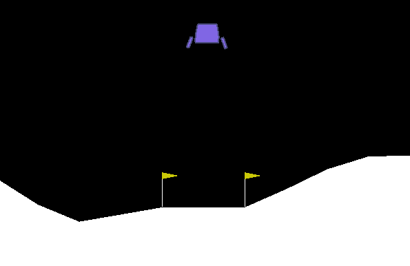

to avoid the "No-Landing" policy, I play some tricks that, I forced the model to free-falling at first, which increase the possibility to land on the floor and get higher score.

```python
    for t in range(T):
        a = 0;
        s_, r, is_terminal, info = env.step(a)
        s_pixels = env.render(mode="rgb_array");
        s_pixels = imagePreprocess(s_pixels);
```

And here are the results

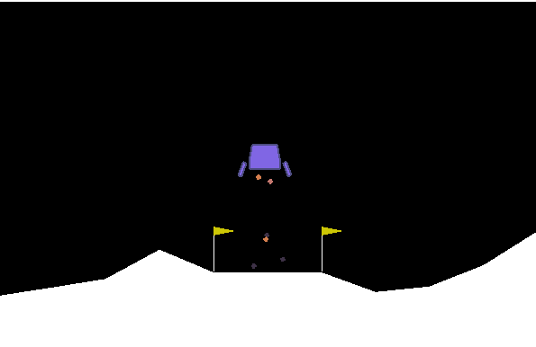

### Personal Thoughts

Reading raw pixels as input does much harder than I have ever thought, the model I train does not converges to the optimization after lots of trial. (It takes me around a week to train and modify, so it is actually miserable experience)

Here are difficulties I have met during the training process

training by pixels is much more difficult to converge. This is one of the cost function during my training process, we will find that it may increase suddenly and unexpectedly. 

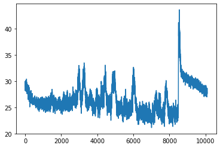

## Reference 

[1]  Van Hasselt, Hado, Arthur Guez, and David Silver. "Deep reinforcement learning with double q-learning." *Thirtieth AAAI conference on artificial intelligence*. 2016. 

[2]  Wang, Z., Schaul, T., Hessel, M., Van Hasselt, H., Lanctot, M., & De Freitas, N. (2015). Dueling network architectures for deep reinforcement learning. *arXiv preprint arXiv:1511.06581*. 

[3]  Schaul, T., Quan, J., Antonoglou, I., & Silver, D. (2015). Prioritized experience replay. *arXiv preprint arXiv:1511.05952*. 

[4]  Mnih, V., Kavukcuoglu, K., Silver, D., Graves, A., Antonoglou, I., Wierstra, D., & Riedmiller, M. (2013). Playing atari with deep reinforcement learning. *arXiv preprint arXiv:1312.5602*. 